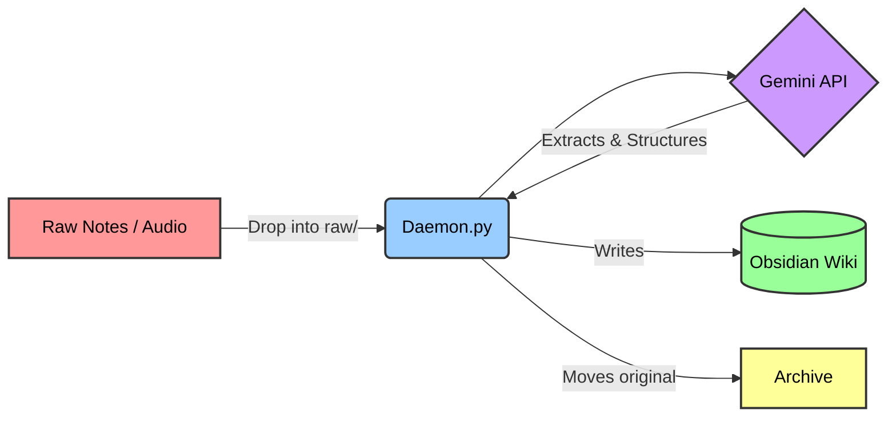

# 🧠 Daemon.md


Daemon.md is a persistent background service that automatically transforms your raw notes, chaotic thoughts, and rambling voice memos into a structured, fully interconnected **Obsidian wiki**.

Inspired by Andrej Karpathy's [LLM Wiki concept](https://gist.github.com/karpathy/442a6bf555914893e9891c11519de94f), this project fundamentally moves away from standard RAG (Retrieval-Augmented Generation) databases. Instead, it uses **Eager Compilation**: it reads your input immediately, extracts the core concepts, and natively writes actual markdown (`.md`) files directly to your local disk, maintaining a rich web of `[[Wikilinks]]` for you.

You drop a voice memo into a folder, and seconds later, your vault is updated, cross-referenced, and meticulously organized.

> [!TIP]
> If you are a developer looking for the technical deep-dive into how the daemon, archiving, and feedback loops work under the hood, please read [docs/ARCHITECTURE.md](docs/ARCHITECTURE.md).

---

## ✨ Features at a Glance

- **⚡ Eager Compilation:** Reads your raw inputs instantly and natively writes interconnected markdown (`.md`) files. No vector databases or RAG necessary.
- **🎙️ Native Audio Processing:** Drop `.m4a`, `.mp3`, or `.wav` files (like iPhone Voice Memos) into the inbox. It securely transcribes, synthesizes, and deletes the remote audio to prevent leaks.
- **🕸️ Autonomous Auto-linking:** Automatically generates Obsidian `[[Wikilinks]]` between concepts. If you mention a topic that doesn't exist yet, it creates a "ghost node" for future use.
- **🔄 The Self-Feedback Loop:** When you manually edit an AI-generated note in your vault, the Daemon detects your changes and formally integrates them into the knowledge graph.
- **📦 Immutable Archiving:** Your original, raw notes and audio files are never deleted. They are safely preserved in an `archive/` folder, acting as your ultimate source of truth.
- **📖 Weekly Narrative:** A background service synthesizes the past 7 days of your thoughts into a beautifully written weekly journal entry.
- **🌐 3D Graph Visualizer:** Spin up an interactive, local 3D map of your entire knowledge graph directly in your browser.
- **🛡️ Built-in Circuit Breaker:** Protects your API quota by automatically halting the background daemon if it detects an infinite retry loop or excessive usage.

---

## 🌊 The Workflow



---

## 🚀 Quick Start Guide

### Prerequisites
- **macOS:** Required for the background service and native push notifications.
- **Python 3:** Installed and available in your PATH.
- **Node.js & npm:** Installed (required for the 3D visualizer).
- **Obsidian:** Installed on your Mac.
- **Google Gemini API Key:** Get a free key from [Google AI Studio](https://aistudio.google.com/apikey).

### Step 1: Setup the Engine
The engine code lives in this repository, entirely separate from your actual notes to keep your vault clean. Core configurations are centralized in a `config.py` file to maintain a tidy codebase.

1. Clone this repository:
   ```bash
   git clone https://github.com/ahoy-cmyk/daemon.md.git
   cd daemon.md
   ```
2. Copy the environment template:
   ```bash
   cp .env.example .env
   ```
3. Open `.env` and configure your API key and the desired path for your new Obsidian Vault:
   ```text
   GEMINI_API_KEY="AIzaSyYourKeyHere..."
   VAULT_PATH="~/Documents/My_AI_Vault"
   ```

### Step 2: Install and Start
Run the comprehensive installer script:
```bash
./install.sh
```
> [!NOTE]
> This script will verify your permissions, build the directory structure in your `VAULT_PATH`, set up a Python virtual environment, install dependencies, and register the background service natively with macOS (`launchd`) so it runs silently forever.

### Step 3: Open Obsidian
1. Launch the **Obsidian** app.
2. Click **"Open folder as vault"**.
3. Select the folder you defined in your `VAULT_PATH` and click **Open**.

You are now fully operational! 🎉

---

## 📖 How to Use It (Day-to-Day)

### 1. Ingesting Raw Notes and Audio
Inside your newly created Vault, you will see a folder called `raw/`.
This serves as your universal inbox.

> [!IMPORTANT]
> If you write a quick thought in a `.txt` file, or record a voice memo on your iPhone (`.m4a`) and drop it into the `raw/` folder, the background Daemon immediately wakes up.

It effortlessly uploads the file, transcribes it, analyzes it against your existing wiki, and writes new or updated markdown files into your `wiki/` folder. You will receive a satisfying macOS push notification when it finishes.

### 2. The Continuous Ledger
Every time the Daemon successfully processes a raw note or audio file, it quietly appends a timestamped entry to `log.md` at the root of your vault. This creates a hard, parseable chronological timeline—a running ticker of your brain's velocity. If you ever need to find a thought based on *when* you had it rather than *what* it was about, the ledger is your breadcrumb trail.

### 3. Manual Edits
You are never locked out of your own thoughts. If the AI generates a concept page and you want to fix a typo, add a paragraph, or write a completely new page yourself—just do it.

When you type and save a file inside the `wiki/` folder, the Daemon is watching. It automatically copies your manual edit back into the `raw/` inbox. This forces the AI to digest your human input and formally integrate it into the overall knowledge graph.

### 4. The Source of Truth (Archiving)
When the Daemon processes a file from the `raw/` folder, it **never deletes it**. Instead, it moves the original file into the `archive/` folder. This means you will never lose your original voice memos or unedited ramblings.

### 5. Customizing the AI (GEMINI.md)
Inside your Vault, you will find a file named `GEMINI.md`. This is the **Master Prompt** for the system.
Every time the Daemon processes a note, it reads `GEMINI.md` to understand precisely how it should behave.

> [!TIP]
> You can heavily edit this file to give the AI custom instructions. Tell it to use a specific tone, categorize notes into new folders, or look out for specific keywords (e.g., "If I mention 'Groceries', always add it to a specific checklist").
>
> **Note on Updates:** If you leave `GEMINI.md` in its default, stock state, running `./update.sh` will automatically detect and upgrade it if there are improvements to the master prompt. However, as soon as you customize it, the updater will respect your changes and never overwrite them!

### 6. The Weekly Narrative
Once a week, the background linter script runs. In addition to fixing broken links and suggesting new synthesis nodes, it reads the last 7 days of your `log.md` file. It uses this chronological data to weave together a beautifully written "Weekly Narrative" journal entry within your `Maintenance_Report.md` file, summarizing exactly what your brain was obsessed with that week.

---

## 🛠️ Available Commands

This repository includes several bash scripts to help you seamlessly manage the system. Run these from the `daemon-md` directory:

- `./status.sh`
  Checks if the background daemon is alive, shows you how many API tokens you've used (and the exact cost), and prints the latest logs.

- `./start_visualizer.sh`
  Spins up a local web server (on `localhost:5173`). Open this in your browser to see a stunning 3D, interactive map of your entire knowledge graph. It smartly highlights **"Ghost Nodes"** (concepts the AI linked to, but hasn't fully written a page for yet).

- `python rebuild.py`
  Because your original notes are safely stored in the `archive/`, you can rebuild the entire system from scratch. This script warns you, wipes the generated wiki, and sequentially feeds your entire history back through the Daemon. Use this in a year when a much smarter AI model is released to retroactively upgrade all your old notes!

- `./update.sh`
  Pulls the latest code from GitHub and safely restarts the background services.

- `./uninstall.sh`
  Stops the background services and removes them from macOS. (This does *not* delete your Obsidian Vault or your actual notes).

---

## ❓ Frequently Asked Questions (FAQ)

**Q: Does this upload my personal notes to the cloud?**
**A:** Yes, the Daemon securely uploads your raw text and audio to the Google Gemini API for processing. However, it explicitly deletes any uploaded audio files immediately after transcription to prevent remote storage leaks, and the resulting markdown files are strictly stored locally on your machine.

**Q: What if the AI hallucinates, messes up my notes, or deletes something?**
**A:** Your raw notes are entirely safe. The system moves original inputs into an `archive/` folder—it never deletes them. If the AI hallucinates or overwrites something incorrectly, there is a built-in safety net to prevent massive file truncations, and you can completely rebuild your wiki from the `archive/` using `python rebuild.py`.

**Q: Can I manually edit the AI-generated notes?**
**A:** Yes! The Daemon features a "Self-Feedback Loop." When you manually edit a file in the `wiki/` directory, the background service detects your changes, copies the edit to the inbox, and seamlessly integrates your new thoughts into the knowledge graph.

**Q: How much does the Gemini API cost?**
**A:** Google offers a free tier for the Gemini API that provides enough capacity for most individual users. If you exceed the free tier, the project includes a local usage tracker—you can run `./status.sh` to check precisely how many tokens you have consumed and the estimated cost.

**Q: Why does this require macOS?**
**A:** Daemon.md deeply integrates with native macOS tools. It leverages Apple's `launchd` service to ensure the background daemon stays alive forever and uses AppleScript (`osascript`) to send satisfying native desktop push notifications whenever notes are processed or the weekly narrative is generated.
