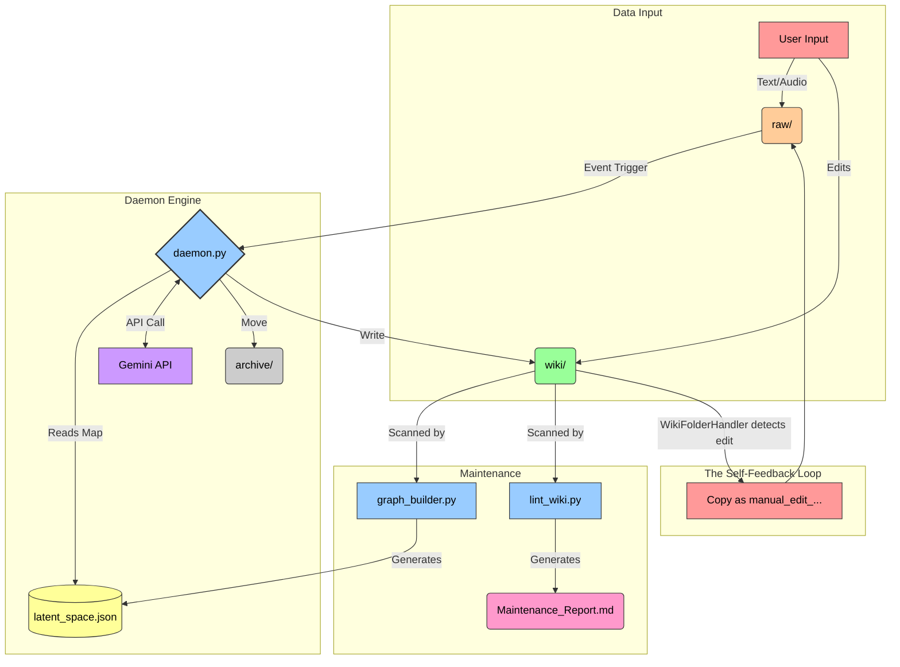

# 🏗️ Daemon.md Architecture

This document serves as a comprehensive, exhaustive technical deep-dive into the architecture of Daemon.md. It is specifically intended for developers, maintainers, and technically curious users who want to understand exactly how the system operates under the hood.

---

## 1. 🧠 The Core Concept: Eager Compilation vs. RAG

Daemon.md was directly inspired by the "LLM Wiki" concept [proposed by Andrej Karpathy](https://gist.github.com/karpathy/442a6bf555914893e9891c11519de94f).

Most modern AI knowledge systems rely heavily on **Retrieval-Augmented Generation (RAG)**:
- You upload documents.
- The system chunks the text, runs it through an embedding model, and saves it to a vector database.
- When you ask a question, it retrieves chunks of text via similarity search and formulates an answer on the fly.

> [!WARNING]
> **The RAG Flaw:** It must rediscover knowledge from scratch every time. It struggles with holistic synthesis because the knowledge only exists as fragmented math in a database.

Daemon.md completely replaces RAG with **Eager Compilation**:
- **Ingestion Time, Not Query Time:** When a raw file drops into the system, the LLM reads it immediately. It doesn't blindly index it; it actively writes it into interconnected, human-readable markdown files (`.md`).
- **A Compiled Wiki:** The LLM performs the tedious bookkeeping humans hate. It creates dedicated entity pages, intelligently updates concepts, flags contradictions, and maps out a localized web of knowledge connected by Obsidian `[[Wikilinks]]`.
- **The Result:** The knowledge base is fully compiled natively on your hard drive. The cross-references are already established. The knowledge compounds and gets richer with every source you add, acting as a true "second brain".

---

## 2. 📁 Vault Directory Structure

Daemon.md strictly separates the execution logic (Python scripts, Node.js visualizer) from your personal data. The codebase lives safely in its own repository, while the engine operates exclusively on a target Obsidian Vault directory.

When initialized, Daemon.md seamlessly scaffolds the following structure inside your Vault:

```text
Your_Obsidian_Vault/
│
├── raw/                  # The Inbox. Drop text notes and voice memos here.
├── archive/              # The Source of Truth. Raw files are safely moved here after processing.
├── failed/               # The Quarantine. Unparseable files go here to prevent API retry loops.
│
├── wiki/                 # The Compiled Knowledge Graph (Managed continuously by the AI).
│   ├── entities/         # Pages for people, places, companies, tools.
│   └── concepts/         # Pages for abstract ideas, frameworks, theories.
│
├── Action_Items/         # Executable tasks autonomously extracted from your notes.
│
├── GEMINI.md             # The master prompt controlling the AI's core behavior.
└── Maintenance_Report.md # Generated weekly by the Synthesis Linter.
```

---

## 3. ⚙️ System Components & Data Flow



### 3.1. The Ingestion Engine (`daemon.py`)
This is the pulsing heart of the system—a continuous Python background process actively monitoring the `raw/` directory.

- **Event Watching:** Uses the robust `watchdog` library to capture filesystem `on_created` events in real-time.
- **Polling Fallback:** Features a configurable fallback polling sweep (`DAEMON_POLL_INTERVAL`) to catch silent sync events from cloud providers like iCloud Drive that notoriously drop FSEvents.
- **Native Audio Processing:** Natively processes audio files (e.g., iPhone Voice Memos in `.m4a`, `.mp3`, `.wav`). It securely uploads the audio to the Gemini API for native transcription and analysis, then **explicitly deletes** the remote file in a `finally` block to prevent stealthy storage leaks.
- **Context Optimization:** Feeding a massive vault of markdown files to an LLM on every ingestion is prohibitively expensive and excruciatingly slow. Instead, the daemon feeds the LLM `latent_space.json`—a lightweight structural map of the vault. The LLM smartly uses this map to know what concepts already exist and where to route new information.
- **Strict Formatting:** The LLM is strictly constrained via `google-genai` SDK structured outputs (`types.Schema` and `response_mime_type="application/json"`). It outputs a structured JSON array where each object dictates the target file path and the complete markdown content. The python script then securely parses the raw JSON and writes these files directly to disk.

### 3.2. File Archiving & Full System Rebuilds (`rebuild.py`)
The system meticulously preserves history to future-proof your knowledge.

- **The Archive:** When `daemon.py` successfully ingests a raw file, it does not delete it. It seamlessly moves it to the `archive/` directory with a unique timestamp appended to the filename. This creates an immutable, unindexed source of absolute truth.
- **Rebuilds:** The AI models we use today will be obsolete in just a few years. The `rebuild.py` script allows users to completely wipe their generated `wiki/` and `Action_Items/` directories, and sequentially feed the entire `archive/` history back into the system from scratch. This allows the vault to be retroactively upgraded, applying newer, vastly smarter intelligence to all historical data.

### 3.3. Manual Edits and The Self-Feedback Loop
The wiki is not exclusively AI-generated. Users absolutely must be able to write their own notes or manually fix typos in AI-generated notes without fear of losing those edits during a system rebuild.

- `daemon.py` utilizes a brilliant `WikiFolderHandler` to actively watch the generated `wiki/` directory.
- To cleanly prevent infinite loops, the daemon maintains a `daemon_written_files` dictionary in memory. If the daemon writes a file, it ignores the resulting filesystem event.
- If a human edits or creates a file in the `wiki/`, the handler detects it and secretly copies that modified file back into the `raw/` directory with a `manual_edit_` prefix.
- The AI digests the human edit, formalizes it, and the raw copied file is placed into `archive/`. Therefore, **manual edits become part of the immutable history and easily survive future rebuilds.**

### 3.4. The Continuous Ledger & Weekly Narrative
To bridge the gap between a static encyclopedia and a dynamic "Second Brain," the system maintains a chronological timeline of thoughts.
- **Continuous Ledger:** Upon successful file processing, `daemon.py` dynamically appends the actions taken (e.g., specific files updated or tasks completed) to a `log.md` file at the root of the vault. To ensure thread safety across concurrent workers, this operation is wrapped in a `daemon_write_lock`. The log is automatically rotated monthly (moved to `archive/logs/log_YYYY_MM.md`) to maintain performance.
- **Weekly Narrative:** The linter script (`lint_wiki.py`) reads the last 7 days of entries from this `log.md` file and appends it to the LLM context. The model uses this data to write a beautiful, narrative summary of your week's momentum inside the `Maintenance_Report.md`.

### 3.5. The Synthesis Linter (`lint_wiki.py`)
A background cron job (scheduled reliably via a macOS `launchd` `.plist` file for Sunday nights).
- It carefully packages the entire text of the `wiki/` into a secure XML `<vault_content>` payload.
- It asks a high-powered reasoning model (default: `gemini-3.1-pro-preview`) to comprehensively audit the entire graph using a strict JSON schema.
- It outputs a raw JSON object containing both a detailed Markdown report (identifying logical contradictions, orphaned nodes, synthesis opportunities, and the Weekly Narrative) and an array of automated file fixes.
- **Safety Net:** Before applying automated fixes, a diff-check strictly prevents massive truncations by aborting overwrites if an AI hallucinates and reduces a large file by > 50%.
- It saves the formatted report to `Maintenance_Report.md` at the vault root and seamlessly applies approved automated fixes.

### 3.6. Latent Space Mapping (`graph_builder.py`)
After every single ingestion or linting cycle, this script deeply scans the `wiki/` directory.
- It parses all markdown files, meticulously looking for `[[Wikilinks]]`.
- It dynamically generates a deterministic JSON map (`latent_space.json`) of nodes and edges.
- **Ghost Nodes:** If it finds a wikilink pointing to a concept that does not have a dedicated markdown file yet, it intelligently creates a "Ghost Node" in the JSON.
- This JSON is critically consumed by both the Python Backend (to give the LLM essential structural context) and the Node.js Frontend (for 3D visualization).

---

## 4. 🛡️ Environment, Security, and Edge Cases

Daemon.md is rigorously engineered to run indefinitely as a local service, implementing strict fault-tolerance mechanisms.

> [!CAUTION]
> ### Path Safety and iCloud Deadlocks
> macOS heavily protects Desktop, Documents, and iCloud paths.
> - The `install.sh` script rigorously validates write permissions before scaffolding.
> - **Resource Deadlock Avoidance:** Syncing files via iCloud often causes nasty file locks. The daemon strictly avoids high-level syscalls like `shutil.copy` on incoming files. It cleverly utilizes a polling loop (`st_size > 0`), strategic delays, and `unlink(missing_ok=True)` fallbacks with retry logic to ensure the daemon doesn't violently crash on locked files.

### Failure Handling & Runaway Protection
To strictly prevent catastrophic infinite retry loops that rapidly drain API credits, two layers of defense are implemented:
1. **Quarantine:** If a file causes a JSON parse error or an API failure, it is safely caught by a `try/except` block and immediately moved to the `failed/` directory with a timestamp.
2. **Circuit Breaker:** The `daemon.py` includes a `check_circuit_breaker()` function that intensely monitors the volume of file processing attempts. If the system detects a runaway process (e.g., exceeding `DAEMON_API_CALL_LIMIT` attempts within `DAEMON_API_CALL_WINDOW` seconds), it will aggressively halt the background daemon and dispatch a critical push notification to the user.

### Redaction and Logging
- All Google API usage is precisely extracted (`response.usage_metadata`) and appended to `logs/cost_tracker.jsonl` for deterministic cost auditing.
- A custom `APIRedactingFormatter` intercepts all output within the Python `logging` module, ensuring the user's highly sensitive `GEMINI_API_KEY` is completely scrubbed from disk logs (`daemon.log`, `linter.log`) and standard output streams.
- The logs cleverly use `RotatingFileHandler` constrained to 5MB, effortlessly maintaining a small, deterministic disk footprint.

### System Integration
- The application relies on native macOS `launchctl` to keep the background daemon reliably alive (`KeepAlive = true`).
- Push notifications are cleanly dispatched natively via AppleScript (`osascript`). To flawlessly prevent command injection vulnerabilities, variables are passed securely as positional command-line arguments (`argv`), not via dangerous string interpolation.