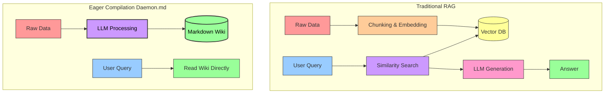

# ⚖️ System Comparison: Daemon.md vs. Karpathy's "LLM Wiki" Proposal

Daemon.md was directly inspired by Andrej Karpathy's ["LLM Wiki" concept](https://gist.github.com/karpathy/442a6bf555914893e9891c11519de94f). This document explicitly outlines the core agreements between the two architectures and details the specific engineering improvements Daemon.md dynamically introduces to operationalize the pattern for seamless local, continuous usage.

## 🤝 Core Agreements: The Foundational Philosophy

Daemon.md passionately adopts the fundamental premises outlined in Karpathy's proposal, firmly moving away from stateless Retrieval-Augmented Generation (RAG) toward a persistent, natively compiled knowledge base.

1. **Eager Compilation over RAG**
   RAG systems retrieve relevant chunks of raw data at query time, meaning the LLM must tediously rediscover knowledge and synthesize it from scratch for every question. Both systems strongly agree that knowledge should be "compiled" at ingestion time. The LLM reads the source once, smartly extracts key information, and permanently integrates it into existing, structured markdown files.
2. **The Persistent Wiki as the Intermediate Layer**
   The knowledge base rightfully acts as a stateful artifact between the user and raw sources. The cross-references are brilliantly pre-calculated, contradictions are automatically flagged, and summaries are effortlessly updated incrementally. The wiki is a beautifully structured directory of LLM-generated markdown files that humans enjoy reading and the LLM efficiently writes.
3. **LLM as the Maintainer**
   The tedious bookkeeping required to painstakingly maintain a knowledge base (updating cross-references, maintaining perfect consistency, organizing files) is smartly offloaded entirely to the LLM. The user solely focuses on providing rich sources, deep thinking, and asking profound questions.
4. **Separation of Raw Data and Compiled Output**
   Raw sources are fiercely treated as immutable truth. The system respectfully reads from raw files but never dangerously alters them, gracefully separating the immutable source material from the continuously evolving LLM-owned compiled wiki.
5. **Schema-Driven Behavior**
   Both systems intelligently utilize a configuration schema (`GEMINI.md` in Daemon.md) to explicitly define conventions, precise directory structures, and strict workflows for the LLM to follow, ensuring remarkably disciplined maintenance rather than generic chatbot behavior.

---

## 🚀 Architectural Improvements in Daemon.md

While the Karpathy proposal outlines a brilliant theoretical pattern and casually suggests CLI tools or manual orchestration, Daemon.md boldly provides a remarkably concrete, fully automated, and robust continuous background implementation.

### 1. Continuous Background Execution vs. Manual Ingestion
- **Proposal:** Casually suggests manually dropping files and telling the LLM to process them via a chat interface or CLI.
- **Daemon.md:** Powerfully implements a relentless continuous background service (`daemon.py`) using `watchdog` and clever polling fallbacks (`DAEMON_POLL_INTERVAL`). When a file is simply dropped into the `raw/` directory, the daemon automatically wakes up, effortlessly processes it, seamlessly updates the wiki, and gracefully sends a native macOS push notification upon completion. This entirely removes the annoying need for human-in-the-loop orchestration for basic ingestion.

### 2. Context Optimization via Latent Space Mapping
- **Proposal:** Rudimentarily relies on an `index.md` catalog for the LLM to clumsily navigate the wiki before drilling into specific pages.
- **Daemon.md:** Intelligently implements `graph_builder.py`, which deterministically generates a `latent_space.json` map of the entire vault instantly after every ingestion. This map provides a breathtakingly lightweight structural overview of all nodes (files) and edges (wikilinks), including "Ghost Nodes" (links to concepts that don't exist yet). The daemon efficiently feeds this JSON to the LLM instead of the entire text of the vault, significantly reducing token consumption and alleviating context window pressure while miraculously maintaining a perfect global structural view.

### 3. The Self-Feedback Loop (Capturing Manual Edits)
- **Proposal:** Naively assumes the LLM entirely owns the wiki layer and the user mostly reads it passively.
- **Daemon.md:** Smartly recognizes that users will inevitably edit the generated markdown to fix typos or add brilliant thoughts. A `WikiFolderHandler` actively monitors the `wiki/` directory. If a human delightfully edits a file (verified by intelligently tracking the daemon's own disk writes), it automatically and secretly copies the modified file back to the `raw/` inbox with a `manual_edit_` prefix. The AI hungrily ingests this edit, flawlessly formalizing the human's invaluable input into the overall knowledge graph.

### 4. Archiving and Full System Rebuilds
- **Proposal:** Briefly mentions keeping raw sources as immutable files but carelessly doesn't prescribe a system-wide versioning strategy across LLM model upgrades.
- **Daemon.md:** Safely moves processed files from `raw/` to `archive/` rather than permanently deleting them. This establishes an incredibly valuable unindexed source of truth. The `rebuild.py` script magnificently allows users to clear the generated wiki and sequentially feed the entire archive back through the system. This profoundly enables users to retroactively upgrade their entire knowledge base when newer, dramatically more capable LLMs are released, guaranteeing the data is not hopelessly locked to the intelligence of a specific point in time.

### 5. Automated System Maintenance (Synthesis Linter)
- **Proposal:** Gently suggests periodically asking the LLM to painfully lint the wiki for contradictions, orphans, and gaps.
- **Daemon.md:** Completely automates this via `lint_wiki.py`, reliably designed to run as a scheduled cron job. It neatly packages the vault content and aggressively prompts a powerful reasoning model (e.g., `gemini-3.1-pro-preview`) to rigorously audit the graph. It automatically outputs a beautiful `Maintenance_Report.md` detailing annoying contradictions and pesky structural issues, flawlessly ensuring the maintenance burden remains near zero.

### 6. Native Audio Processing
- **Proposal:** Narrowly focuses primarily on text, web clippings, and images.
- **Daemon.md:** Superbly supports native audio ingestion (`.m4a`, `.mp3`, `.wav`) by seamlessly uploading media directly to the Gemini API for highly accurate transcription and analysis. It securely and cleanly handles the file lifecycle, absolutely ensuring remote files are explicitly deleted after processing to brilliantly prevent nasty storage leaks and painful quota exhaustion.

### 7. Native OS Integration and Lifecycle Control
- **Proposal:** Uncomfortably assumes the user is either manually running messy scripts in the terminal or clunkily wiring up an agent orchestrator.
- **Daemon.md:** Hooks beautifully and directly into macOS via `launchd` and property list (`.plist`) files securely generated by `install.sh`. The ingestion engine (`daemon.py`) runs as a wonderfully persistent background daemon, and the synthesis linter (`lint_wiki.py`) runs as a trusty cron job (defaulting to Sunday at 3 AM). Users delightfully maintain total control over the lifecycle via included, friendly shell scripts without having to foolishly remember terminal commands:
  - `./status.sh` reports if the `launchd` services are happily running, transparently displays token usage/cost, and tails the latest logs.
  - `./uninstall.sh` instantly and cleanly unloads and removes the background services.
  - `./update.sh` swiftly pulls the latest code and safely restarts the vital processes.

## 🎉 Conclusion

Daemon.md completely embraces the profound LLM Wiki philosophy but hyper-focuses on violently removing the unbearable friction of manual operation. By implementing a relentless continuous background daemon, structured context mapping, seamless human-in-the-loop feedback, and rock-solid deterministic archiving, it miraculously transforms the "LLM Wiki" concept from an interactive prompt pattern into an incredibly powerful, autonomous, locally-running knowledge engine.
